# edge-influxdata-stack

The famous InfluxData TICK Stack for SIEMENS Industrial Edge.

- [edge-influxdata-stack](#edge-influxdata-stack)
  - [Introduction](#introduction)
    - [Before Starting](#before-starting)
  - [Requirements](#requirements)
    - [Used Components](#used-components)
    - [Hardware Requirements](#hardware-requirements)
    - [Software Requirements](#software-requirements)
  - [Installation](#installation)
    - [Prerequisites](#prerequisites)
    - [Download the App](#download-the-app)
    - [Uploading App to IEM](#uploading-app-to-iem)
      - [Importing App Files into IEM Portal](#importing-app-files-into-iem-portal)
      - [Importing App Files into Edge App Publisher](#importing-app-files-into-edge-app-publisher)
    - [App installation on Edge Device](#app-installation-on-edge-device)
  - [Usage](#usage)
    - [InfluxDB](#influxdb)
    - [Chronograf](#chronograf)
    - [Kapacitor](#kapacitor)
    - [Create a new database with Chronograf](#create-a-new-database-with-chronograf)
    - [Reading data from the database with Chronograf](#reading-data-from-the-database-with-chronograf)
  - [Application Examples](#application-examples)
    - [Description](#description)
    - [Scope of the examples](#scope-of-the-examples)
    - [Before starting with examples](#before-starting-with-examples)
    - [Install InfluxDB node on NodeRED](#install-influxdb-node-on-nodered)
    - [Configuring data exchange with SIMATIC S7 Connector App and IE Databus App](#configuring-data-exchange-with-simatic-s7-connector-app-and-ie-databus-app)
    - [ConnectionMap creation for Tag Name - Tag Id Mapping](#connectionmap-creation-for-tag-name---tag-id-mapping)
    - [Writing data from IE Databus with MQTT protocol to InfluxDB database](#writing-data-from-ie-databus-with-mqtt-protocol-to-influxdb-database)
      - [Bulk message receiving from MQTT](#bulk-message-receiving-from-mqtt)
      - [Pre-processing Data for InfluxDB](#pre-processing-data-for-influxdb)
      - [Buffer datasets in Batch](#buffer-datasets-in-batch)
      - [Sending Data to InfluxDB](#sending-data-to-influxdb)
    - [Dashboard for Displaying Results with Chronograf](#dashboard-for-displaying-results-with-chronograf)
      - [Create new widget on Dashboard Chronograf](#create-new-widget-on-dashboard-chronograf)
    - [Read data from dedicated InfluxDB database with temporal and conditional filtering](#read-data-from-dedicated-influxdb-database-with-temporal-and-conditional-filtering)
    - [Dashboard for Displaying Results with SIMATIC Flow Creator](#dashboard-for-displaying-results-with-simatic-flow-creator)
  - [Build](#build)
    - [Influxdb/Dockerfile](#influxdbdockerfile)
    - [Importing the app into Edge App Publisher](#importing-the-app-into-edge-app-publisher)
    - [Reverse Proxy Configuration for Chronograf](#reverse-proxy-configuration-for-chronograf)
  - [Documentation](#documentation)
  - [Contribution](#contribution)
  - [License & Legal Information](#license--legal-information)

## Introduction

The edge-influxdata-stack application allows you to bring directly to the Edge Device database and administration services from InfluxData stack, expressly dedicated to data as time series. This set of services is called "TICK Stack", from the names of the 4 services used:

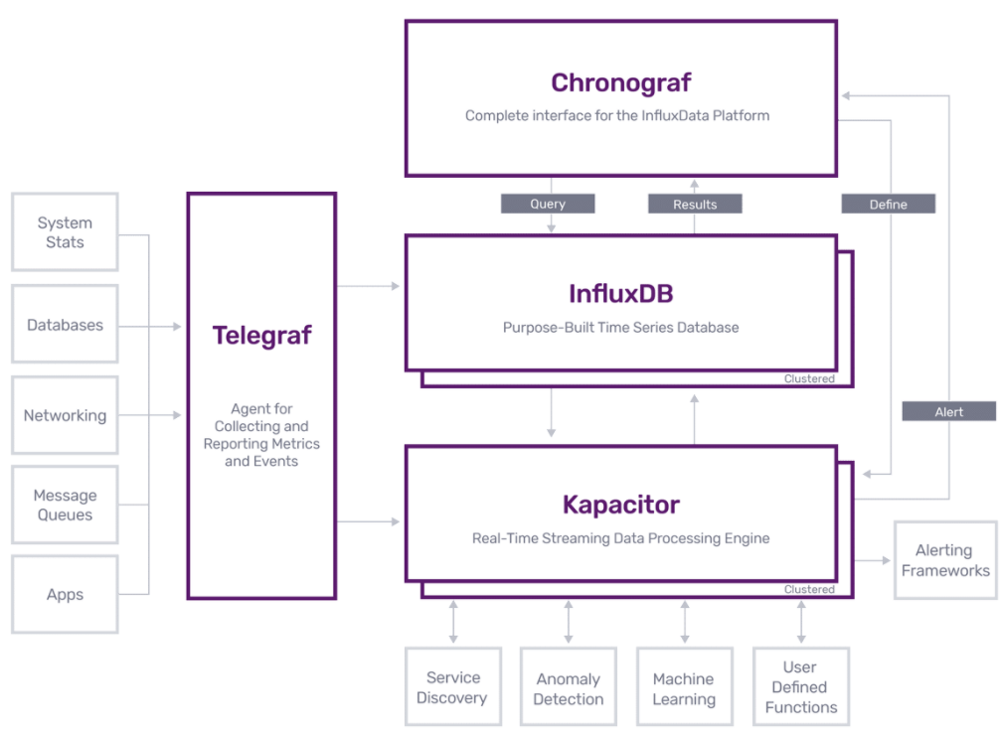

- [Telegraf](https://www.influxdata.com/time-series-platform/telegraf/): is an agent server based on multiple plugins for collecting and reporting metrics. (In this application we will not consider the Telegraf service since it is not needed for our purpose, but it can be integrated by the user by simply adding it in the docker-compose file along with the other services)
- [InfluxDB](https://www.influxdata.com/products/influxdb/): is a time series database built to handle high write and query loads. InfluxDB is a high-performance custom datastore written specifically for time-series data, and particularly useful for use cases such as IoT monitoring and real-time analytics. InfluxDB also offers a SQL-like query language to interact with the data
- [Chronograf](https://www.influxdata.com/time-series-platform/chronograf/): is the administrative user interface and visualization engine for the stack. It makes it easy to set up and maintain monitoring and alerts for your infrastructure. It is simple to use and includes templates and libraries that allow you to quickly build dashboards with real-time views of your data and easily create alerting and automation rules.
- [Kapacitor](https://www.influxdata.com/time-series-platform/kapacitor/): is a native data processing engine. It can process both streaming and batch data from InfluxDB. It allows you to insert custom logic or user-defined functions to process alerts with dynamic thresholds, match metrics to patterns, calculate statistical anomalies, and perform specific actions based on these alerts

For more information on TICK Stack check out the official [InfluxData page](https://www.influxdata.com/time-series-platform/).

### Before Starting

This guide describes how to use and install the **edge-influxdata-stack** App.

Check the necessary requirements on [Requirements](#requirements) before proceeding with the installation. Details for the installation procedure can be found on [Installation](#installation).

For full details about the InfluxData services used in the app and for all online references to their use see [Usage](#usage).

The application comes with an [Application Example](#application-example), which shows how to manage the data flow with the InfluxDB database via the **SIMATIC Flow Creator** (Node-RED) application and the dedicated node [node-red-contrib-influxdb](https://flows.nodered.org/node/node-red-contrib-influxdb). In addition, it will be shown how to view the read data via Chronograf dashboard functionality and via the SIMATIC Flow Creator dashboard. For more information on installing the dedicated InfluxDB node see [Install InfluxDB Node on NodeRED](#install-influxdb-node-on-nodered).

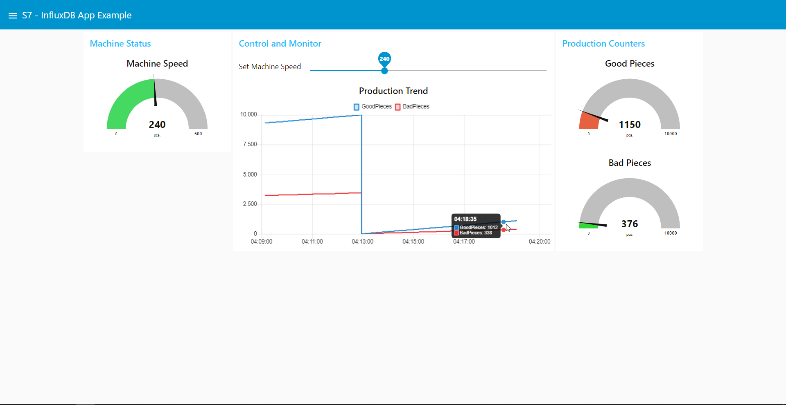

The section [Build](#build) shows in detail how this application was built using the Docker environment.

## Requirements

### Used Components

- OS: Windows or Linux
- Docker minimum V18.09
- Docker Compose V2.0 – V2.4
- Industrial Edge App Publisher (IEAP) V1.2.8
- Industrial Edge Management (IEM) V1.2.16
- Industrial Edge Device (IED) V1.2.0-56

### Hardware Requirements

- The edge-influxdata-stack application is only compatible with SIEMENS devices that have Industrial Edge functionality enabled.

### Software Requirements

- The edge-influxdata-stack application needs **1800 MB** of RAM to run, divided as below among the various microservices:

| Service name | Memory limit |
|--------------|--------------|
| edge-influxdb | 1200 MB |
| edge-chronograf | 400 MB |
| edge-kapacitor | 200 MB |

> **Note:** These limits have been set for an average data volume in the InfluxDB database and to ensure a constant average usage of Chronograf dashboards, but they can be modified according to your needs by acting on the docker-compose file and then on the app configuration in the Edge App Publisher software, creating a custom version of this application.

## Installation

The edge-influxdata-stack application is delivered with the pre-built app package edge-influxdata-stack_x.x.x.app  which can be installed specifically on Edge Devices using SIMATIC Edge.

### Prerequisites

- A properly configured and onboarded Edge Device on an accessible Industrial Edge Management (IEM) system with the appropriate requirements.
- If using Industrial Edge App Publisher to edit/publish the app you will need a connection to a Docker Engine for the Industrial Edge App Publisher software.

### Download the App

The **edge-influxdata-stack** app can be downloaded in .app format using this secure Google Drive link:

- [edge-influxdb2_0.1.2.app](https://drive.google.com/file/d/1Ou7Luc-2lgScXDk41eqWed-UsJTQo7fb/view?usp=sharing)

### Uploading App to IEM

#### Importing App Files into IEM Portal

1. Copy the downloaded edge-influxdata-stack_x.x.x.app file (depending on the x.x.x version) to your PC.
2. Open the IEM Portal web page of the Industrial Edge Management system that controls the desired Edge Devices.
3. In the Catalog section, press the "+ Import Application" button and select the file on your PC via "Browse".
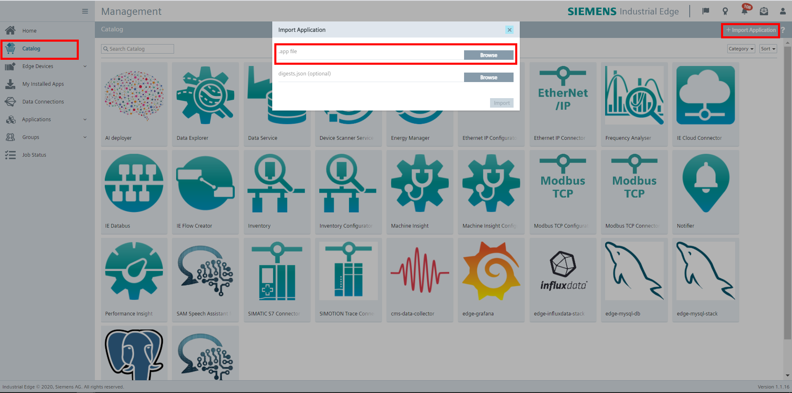
4. Wait for the app to be imported. You can check the status via the "Tasks" button in the top right corner.

#### Importing App Files into Edge App Publisher

1. Copy the downloaded edge-influxdata-stack_x.x.app file (depending on the x.x.x version) to your PC.
2. Open the Industrial Edge App Publisher software
3. Use the Import button to open the menu to import the provided app file and select the file on your PC using the Browse button.
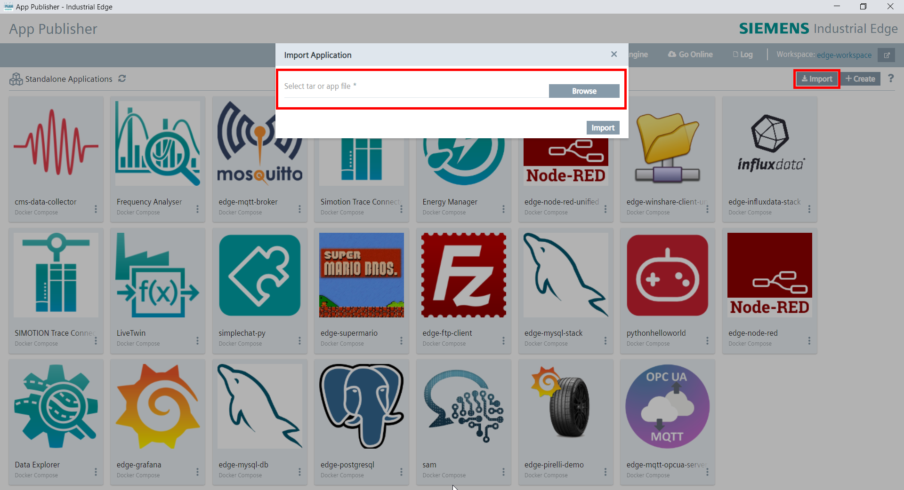
4. Wait for the application import to complete.
5. When finished, the application will be visible in the Standalone Applications section of the Industrial Edge App Publisher software. It is also possible to create a new version of the application in the dedicated repository menu by clicking on the application icon.
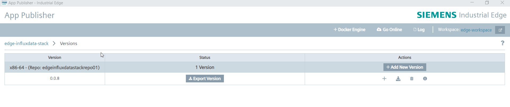
6. Connect to your IEM via the "Go Online" button by entering the https address of your IEM and pressing Connect. You will be prompted for a user login.
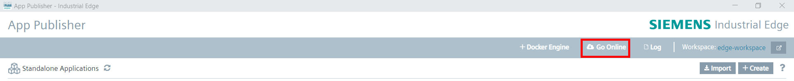
7. Once connected, the Projects and Applications currently on IEM will appear. Choose or create a new project where you can place the provided application.
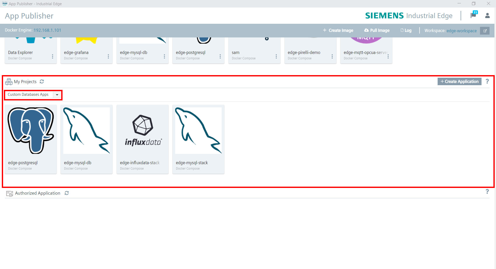
8. Open the edge-influxdata-stack app repository menu by pressing in the Standalone Application section the app icon.
9. Press the "Import Version to Edge Management" button to import the app to IEM.
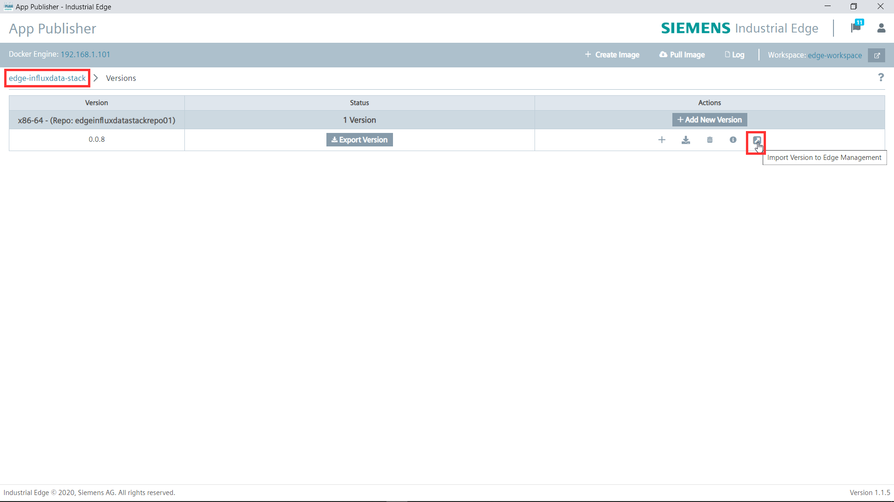
10. Select a project to upload the application to and press "Create" to run the task of importing the application to IEM. Wait for the task to complete. The status of the task is visible in the Tasks section.
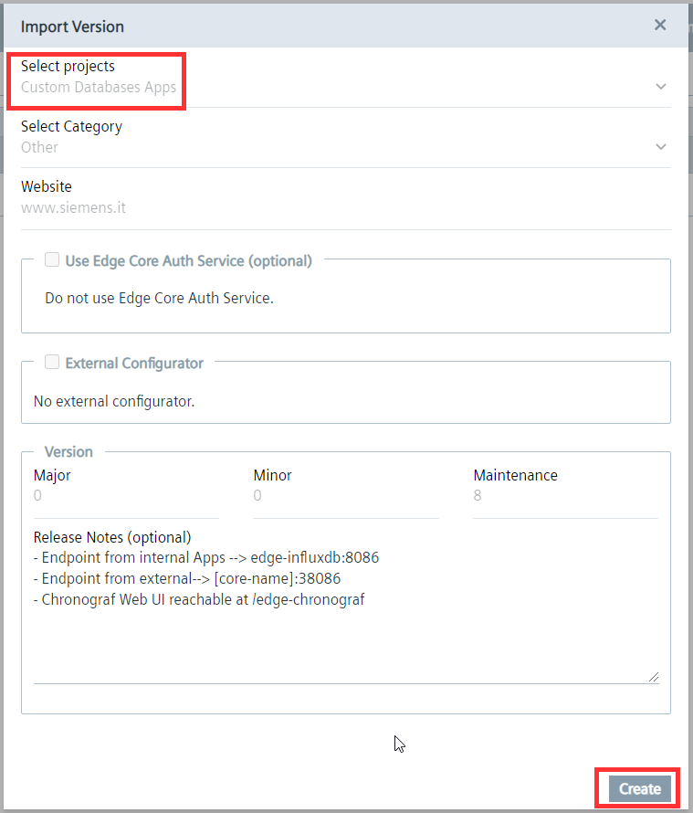
11. Now go to the My Projects section of the Edge App Publisher software, select the project where the edge-influxdata-stack application is located and enter the repository menu.
12. Press Start Upload to begin transferring the desired version to the local application catalog of the IEM instance. Wait for the app to load. You can check the status via the "Tasks" button in the top right corner.
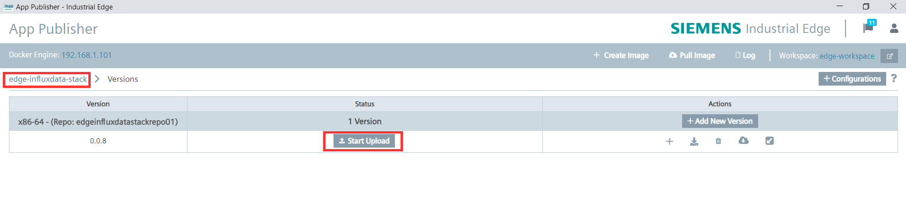
13. At the end of the upload it will be possible to verify the presence of the app in the My Projects menu of the Application section of the IEM web portal.
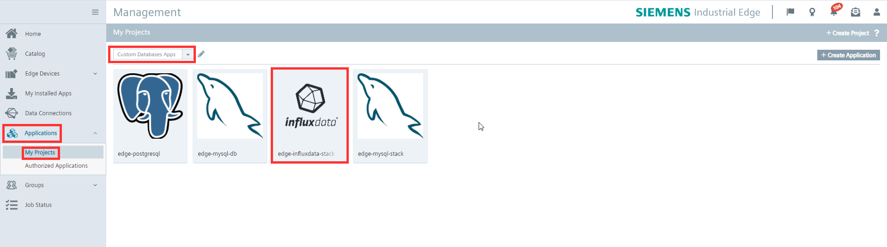
14. Press the "Publish" button in the top right corner to choose the version to be made public in the IEM Catalog and publish the application.
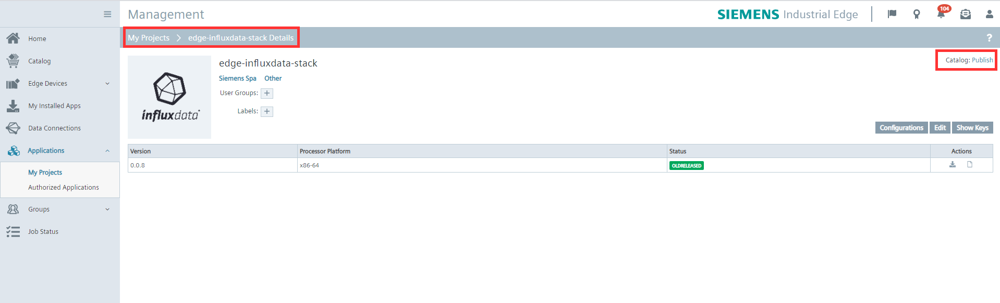
15. Verify that the desired version of the application is now in the "Live" state and that the application created with the correct version is visible in the Catalog section of the IEM Portal.
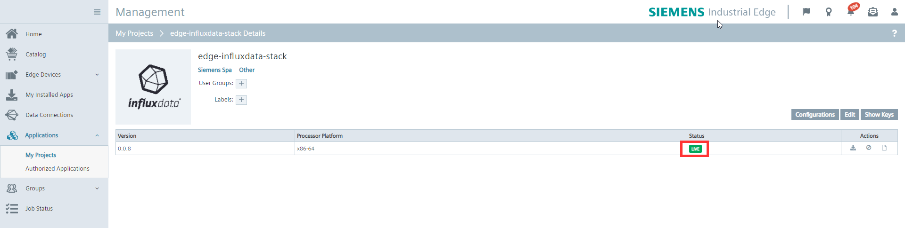

### App installation on Edge Device

Once you have imported the app into your IEM Catalog following the previous paragraph, you can select it for installation on one of the managed Edge Devices.

1. From the Catalog section select the edge-influxdata-stack app to open the dedicated window.
2. Press Install, select the Edge Device on which you want to install the app and press Install.
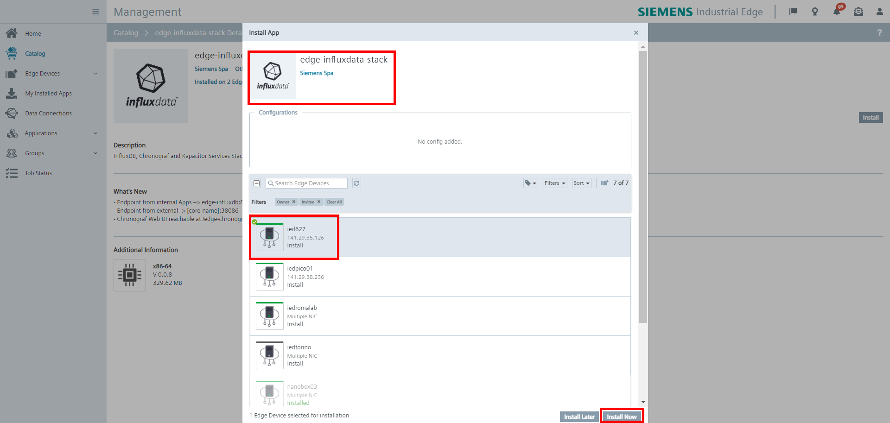
3. A task will be created on the Edge Device for installation. Wait for the app to install. You can check the status in the Job Status section or on the Edge Device in the Tasks menu.
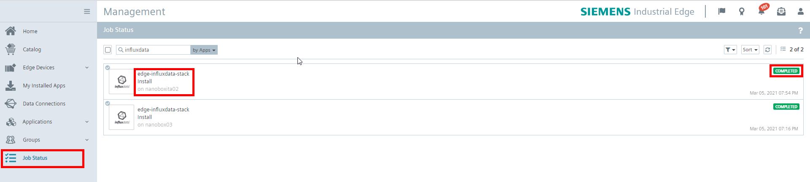
4. Now you can use the app from the configured Edge Device.

## Usage

As specified in [Introduction](#introduction), the edge-influxdata-stack application is based on the InfluxDB, Chronograf and Kapacitor application stack.

The different services that make up the application and their different usage modes are presented below:

### InfluxDB

InfluxDB is a time series database designed to handle high write and query loads. It is a component of the [TICK Stack](https://www.influxdata.com/time-series-platform/). InfluxDB is meant to be used as" "backing store" for any use case involving large amounts of timestamped data, including DevOps monitoring, application metrics, IoT sensor data, and real-time analytics.

- For more details regarding time series databases see ["What is a timeseries database?"](https://www.influxdata.com/time-series-database/).
- Complete InfluxDB documentation is available at official ["InfluxDB Documentation"](https://docs.influxdata.com/influxdb/v1.8/).

Here are some of the features that InfluxDB currently supports that make it a great choice for working with time series data.

- High performance custom data storage written specifically for time series data. TSM engine allows for high loading speed and data compression.
- Written entirely in Go. Compiles to a single binary with no external dependencies.
- Simple and powerful HTTP write and query APIs.
- Plugin support for other data ingestion protocols such as Graphite, collectd and OpenTSDB.
- Expressive SQL-like query language tailored to easily query aggregate data.
- Tags allow series to be indexed for fast and efficient queries.
- Retention policies automatically and efficiently expire obsolete data.
- Continuous queries automatically calculate aggregate data to make frequent queries more efficient.

InfluxDB provides two ways to query the database, with two Query languages called FLUX and InfluxQL. The edge-influxdata-stack application and the application example in [Application Examples](#application-examples) use the InfluxQL Query language, which is very similar to the query languages used in classic SQL databases.

- For similarities and differences between a classic SQL database and the InfluxDB time-series database see ["Compare InfluxDB to SQL databases"](https://docs.influxdata.com/influxdb/v1.8/concepts/crosswalk/).
- The complete InfluxQL query lingo guide can be found at ["Influx Query Language (InfluxQL)"](https://docs.influxdata.com/influxdb/v1.8/query_language/).

### Chronograf

Chronograf is InfluxData's graphical web application. Chronograf allows you to administer the other components of the TICK Stack to visualize collected and monitoring data using custom queries and easily create alerting rules and data flow automation.

- For more information on the Chronograf service check out the official ["What is Chronograf?"](https://www.influxdata.com/time-series-platform/chronograf/).
- The introductory guide to the use of Chronograf is available at ["Getting Started With Chronograf"](https://docs.influxdata.com/chronograf/v1.8/introduction/getting-started/)

Here are some of the main features of Chronograf service:

- Monitor application data with dashboards pre-created by Chronograf
- Create custom dashboards complete with various types of charts and variables
- Investigate data with Chronograf data explorer and query templates
- Manage alerts together with Kapacitor, the InfluxData's data processing framework for creating alerts, running ETL jobs and detecting anomalies in your data.
- Generate threshold alerts on your data, display all active alerts on a dashboard and send alerts to other event management services including Slack, Telegram and others.
- Create and delete databases and implement retention policies
- View running queries and prevent inefficient queries from overloading your system
- Create, delete and assign permissions to users

Several guides on how to use Chronograf to implement the features described above are available at ["Guides for Chronograf"](https://docs.influxdata.com/chronograf/v1.8/guides/)

### Kapacitor

Kapacitor is TICK Stack's data processing framework that makes it easy to create alerts, run ETL jobs, and detect anomalies.

- For more information about the Kapacitor service check out the official link ["Why use Kapacitor?"](https://www.influxdata.com/time-series-platform/kapacitor/)
- The official Kapacitor documentation is available at the link ["Kapacitor 1.5 documentation"](https://docs.influxdata.com/kapacitor/v1.5/)

Here are some of the features that Kapacitor currently supports that make it a great choice for data processing:

- Processes both streaming data and batch data.
- Query data from InfluxDB in a scheduled fashion
- Perform any transformation currently possible in InfluxQL.
- Stores transformed data in InfluxDB.
- Adds user-defined custom functions to detect anomalies.
- Integrate with other services such as HipChat, OpsGenie, Alerta, Sensu, PagerDuty, Slack and others.

Several tutorials and guides to using Kapacitor are available at the official links ["Kapacitor Guides"](https://docs.influxdata.com/kapacitor/v1.5/guides/) and ["Working with Kapacitor"](https://docs.influxdata.com/kapacitor/v1.5/working/).

Some of the features of the TICK Stack are presented below:

### Create a new database with Chronograf

To create a new database within InfluxDB you can use the Chronograf service, following the steps below:

1. Connect to the Chronograf interface using the URL `https://[device-ip-address]/edge-chronograf/`'
2. In the "InfluxDB Admin" section press the "Create Database" button
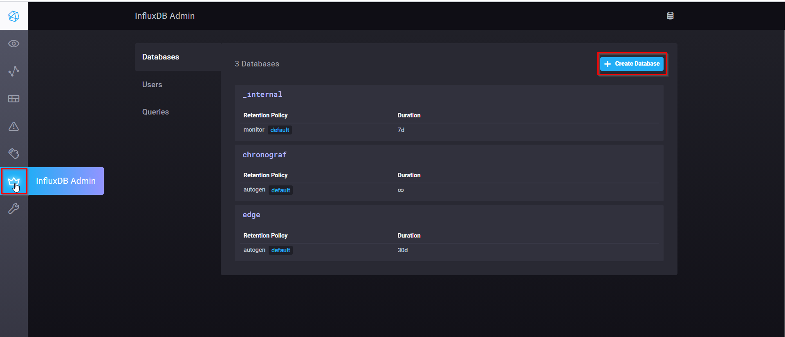
3. Enter the name of the new database to be added and press the "Check" button
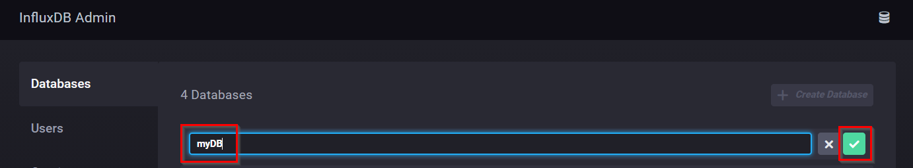
4. The new database is successfully created.

### Reading data from the database with Chronograf

In order to quickly consult the collected data or to test queries, it is useful to use Chronograf and its **"Explore"** feature. Here you will be able to use InfluxDB query languages including InfluxQL to query the database and view the data in different graphical modes in a guided manner.

The following are the steps to be able to perform a query with the guided menu within the "Explore" section:

1. Connect to the Chronograf interface using the URL `https://[device-ip-address]/edge-chronograf/`
2. In the "Explore" section, select in the "DB.RetentionPolicy" column the name of the database and the relative retention policy to be queried.
3. Then select in the "Measurement & Tags" column the measurement of interest and, if necessary, the Tags fields to be used in the query filter.
4. Then select the Fields that you want to read in the "Fields" column and eventually apply the predefined aggregation functions.
5. A query will appear in the editor pane, which you can edit if necessary in order to modify the result.
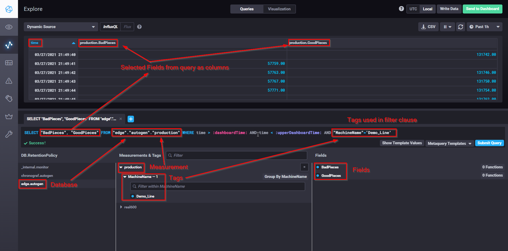
6. Using the time selector at the top right it is possible to set the time range of data request
7. Using the central "Visualization" selector it is possible to modify the type of data visualization

## Application Examples

### Description

Using databases allows you to save data to long term and to be able to act on the collected data for activities such as visualizing historical data or analyzing historical data to gain important information.

In this application example, it will be possible to use the InfluxDB database to implement effective data collection and multiple ways to visualize this information.

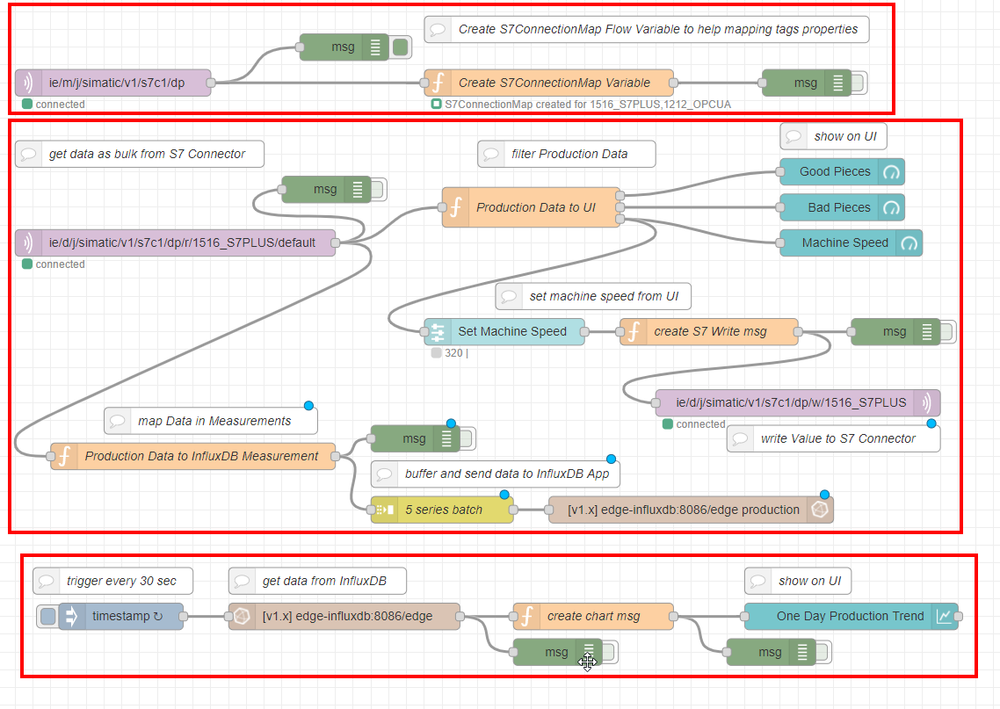

### Scope of the examples

Using the functionality offered by the supplied application and the applications listed in the following section "Prerequisites", you will be able to implement various functionalities:

- Configuration of data exchange with SIMATIC S7 Connector App and IE Databus App
- Writing data coming from IE Databus with MQTT protocol in dedicated InfluxDB database
- Dashboard for results visualization with Chronograf
- Read data from dedicated InfluxDB database with temporal filtering and conditional filtering
- Results visualization with SIMATIC Flow Creator

### Before starting with examples

- To enable communication with an S7 data source, a **PLC** from the SIMATIC family (S7-300, S7-1200. S7-1500,...).
- The **SIMATIC S7 Connector** application must be installed and configured on the Edge Device used.
- The **SIMATIC IE Databus** application must be installed and configured on the Edge Device used.
- The **SIMATIC Flow Creator** application must be installed on the Edge Device in use.
- The node **node-red-contrib-influxdb** must be installed in the node library of SIMATIC Flow Creator. For more details follow the section [below](#install-influxdb-node-on-nodered).

- The [Flow_AppExample_S7toInfluxDB.json](examples/Flow_AppExample_S7toInfluxDB.json) file has to be imported within the SIMATIC Flow Creator application via the "Import" functionality from the dedicated menu.
- The [Production_Chronograf.json file](examples/Production_Chronograf.json) contains the dashboard for Chronograf, which can be imported from the application.
- The **edge-influxdata-stack** application must be installed on the Edge Device used. For more details follow section [Installation](#installation).
- The edge-influxdata-stack application comes with a pre-loaded database named **"edge"**. This database must necessarily exist in order for the created NodeRED stream to work properly.

### Install InfluxDB node on NodeRED

> **NOTE** - The installation of additional nodes in the SIMATIC Flow Creator application (based on Node-RED) is permitted, but these nodes are not officially supported by Siemens.

1. Open the **Editor** page of the **SIMATIC Flow Creator** application by clicking on the icon on the Edge Device UI or by using the URL `https://[core name]/sfc-root/`.
2. From the main menu navigate to the submenu **"Manage Palette"**.
3. Go to the **"Install"** section
4. Search for the node with the name `node-red-contrib-influxdb` and press the **"Install"** button to start the installation.
5. When the installation is finished, close the submenu by clicking the **"Close"** button.
6. If required by the installed node, a **restart** of the SIMATIC Flow Creator application may be necessary.

For more information, please refer to the official documentation of the node [node-red-contrib-influxdb](https://flows.nodered.org/node/node-red-contrib-influxdb).

### Configuring data exchange with SIMATIC S7 Connector App and IE Databus App

In order to be able to use the InfluxDB database for saving information, it is first necessary to perform a data exchange with a data source that can cyclically generate new values.

This application example considers the use of a SIMATIC S7 PLC data source, configured within the **SIMATIC S7 Connector** application by entering the properties necessary for communication and the list of variables to be monitored.
Within the S7 Connector application, in this case, an **S7-1500 CPU** is configured as Datasource with **S7+ protocol** and with **"Bulk Publish"** mode of data publication:

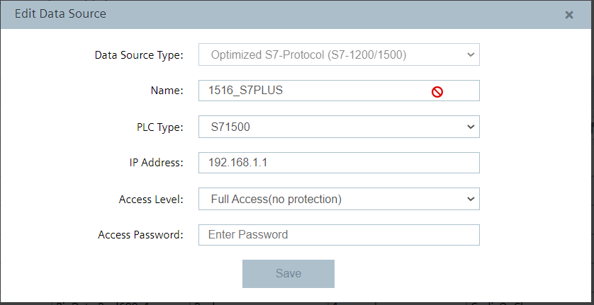

The Bulk Publish mode can be set through the **"Settings"** button present in the S7 Connector configuration interface of the S7 Connector, together with the **user** and **password** used to connect to the MQTT broker of the SIMATIC IE Databus application (in this example we will use user _"simatic"_ and password _"simatic"_):

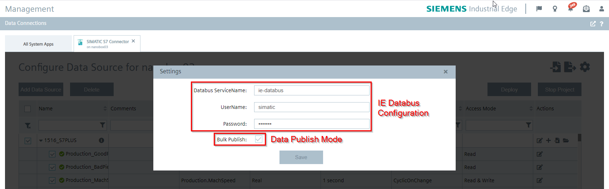

For this purpose 3 variables will be considered, schematized in the following table:

| Id Datapoint | Description | S7+ Address | Type | Access Mode |
|--------------|-------------|-------------|------|------------|
| _Production_GoodPieces_ | Counter Pieces Products | Production.GoodPieces | Dint | Read |
| _Production_BadPieces_ | Discarded Pieces Counter | Production.BadPieces | Dint | Read |
| _Production_MachSpeed_ | Production speed in pieces/min. | Production.MachSpeed | Real | Read&Write |

Below you can see the result of the configuration of the data source with S7 Connector in the **"Data Connections"** section of the Industrial Edge Management system:

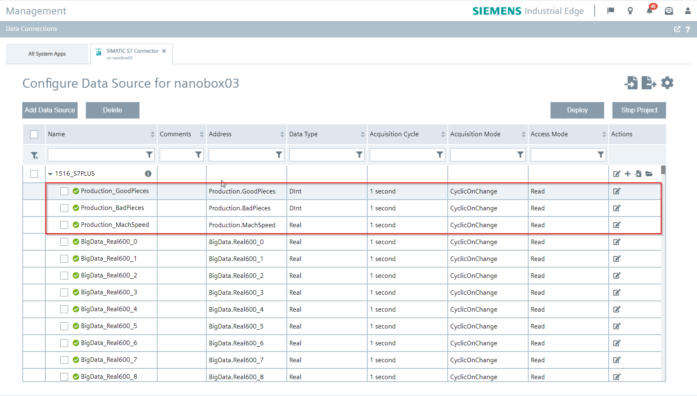

In the "Bulk Publish" mode, when the S7 Connector performs a data read, only one MQTT topic is used where all variables that changed their value in the configured cycle time are published (**"CyclicOnChange"** mode).
The data read from the configured variables will then be available through the **SIMATIC IE Databus** application using the MQTT topic dedicated to the configured datasource (in this example _"1516_S7PLUS"_), which will cyclically emit a JSON message containing also the `vals` property, an array containing all the properties of the read variables.

Here is an example of a JSON message obtained by S7 Connector through MQTT when reading variables:

```bash
{
  "topic": "ie/d/j/simatic/v1/s7c1/dp/r/1516_S7PLUS/default",
  "payload": {
    "seq": 84631,
    "vals": [
      {
        "id": "101",
        "qc": 3,
        "ts": "2021-03-10T22:23:04.146Z",
        "val": 80
      },
      {
        "id": "102",
        "qc": 3,
        "ts": "2021-03-10T22:23:04.146Z",
        "val": 20
      },
      {
        "id": "103",
        "qc": 3,
        "ts": "2021-03-10T22:23:04.146Z",
        "val": 120.5
      }
    ]
  }
}
```

The typical properties of the message obtained by S7 Connector via MQTT when reading variables are analyzed below, with reference to the above example message:

| Property | Description | Example Value |
|----------|-------------|---------------|
| **topic** | Indicates the mqtt topic of the received message | ie/d/j/simatic/v1/s7c1/dp/r/1516_S7PLUS/default |
| **payload** | This is the body of the message. It contains all properties populated by S7 Connector | `{"seq": 84631, "vals": [...] }` |
| **seq** | Progressive number of the read sequence. Each new read increments this number by 1. | 84631 |
| **vals** | Array containing all variables read in a loop and their properties | `[{"id": "101", "qc": 3, "ts": "2021-03-10T22:23:04.146Z", "val": 120.5}, .... ]` |
| **id** | ID of the variable configured within the S7 Connector app | 103 |
| **qc** | Quality Code of reading | 3 |
| **ts** | Timestamp in ISO86901 (yyyy-MM-ddThh:MM:ss) format |"2021-03-10T22:23:04.146Z" |
| **val** | Value of the variable read | 120.5 |

For further information please refer to the dedicated manuals:

- [SIMATIC S7 Connector Operating Manual](https://support.industry.siemens.com/cs/us/en/view/109783783)
- [SIMATIC IE Databus Operating Manual](https://support.industry.siemens.com/cs/us/en/view/109783784)
- [Edge Management Operation Manual](https://support.industry.siemens.com/cs/us/en/view/109793845)

### ConnectionMap creation for Tag Name - Tag Id Mapping

As seen above, the messages received on the topic data contain an `"id"` property, a unique number assigned by **S7 Connector Configurator** to each configured Tag. The correspondence between `"id"` and `"name"` of the various tags is visible in the MQTT message called **"metadata"**, that S7 Connector Configurator sends to each MQTT client connected to the topic `ie/m/j/simatic/v1/s7c1/dp` and that is updated every time the configuration of the Data Source in S7 Connector is modified.

Below is an example of a received MQTT **"metadata"** message:

```json
{
  "topic": "ie/m/j/simatic/v1/s7c1/dp",
  "payload": {
    "seq": 1,
    "connections": [
      {
        "name": "1516_S7PLUS",
        "type": "S7+",
        "dataPoints": [
          {
            "name": "default",
            "topic": "ie/d/j/simatic/v1/s7c1/dp/r/1516_S7PLUS/default",
            "publishType": "bulk",
            "dataPointDefinitions": [
              {
                "name": "Production_GoodPieces",
                "id": "101",
                "dataType": "DInt"
              },
              {
                "name": "Production_BadPieces",
                "id": "102",
                "dataType": "DInt"
              },
              {
                "name": "Production_MachSpeed",
                "id": "103",
                "dataType": "Real"
              },
              {
                "name": "Production_RejectRatio",
                "id": "104",
                "dataType": "Real"
              }
            ]
          }
        ]
      }
    ]
  },
  "qos": 1,
  "retain": true
}
```

In order to trace the `"name"` of the Tag received from the `"id"` property it will be necessary to create a **link** between these two properties obtained on the Metadata topic from S7 Connector.
Inside the flow [Flow_AppExample_S7toInfluxDB.json](examples/Flow_AppExample_S7toInfluxDB.json)  provided in this application example there is a function that creates a global variable called `"S7ConnectionMap"` that contains several correspondence Javascript [Maps](https://developer.mozilla.org/en-US/docs/Web/JavaScript/Reference/Global_Objects/Map?retiredLocale=it) elements that allow to obtain the name of a Tag starting from the id and vice versa.
Below is an example of how to use the **"S7ConnectionMap"** variable in a Flow Creator "function" node:

```js
// get S7Map variable
let S7ConnectionMap = flow.get("S7ConnectionMap");

// find index of PLC connection
let connectionIndex = S7ConnectionMap.nameList.indexOf("1516_S7PLUS");

// use the PLC index to get the right PLC Name -> ID Map
let nameIDMap = S7ConnectionMap.nameIDMaps[connectionIndex];

// use the PLC index to get the right PLC ID -> Name Map
let IDnameMap = S7ConnectionMap.IDnameMaps[connectionIndex];


// USE MAPS
// get Tag ID from Tag Name
let tagId = nameIDMap.get("Production_MachSpeed")
//
// output >> 103

// get Tag Name from Tag ID
let tagName = IDnameMap.get(103)
//
// output >> "Production_MachSpeed"
```

This global variable is created from the MQTT message received by the **"MQTT In" (1)** node on the `ie/m/j/simatic/v1/s7c1/dp` topic with the following **"Function" (2)** node function:

```js
// Create an object that contains each S7 Connector connection property
// with different Map Objects to create correspondence between Tags IDs, Names and Types.

// initialize the connections Mapping Object
let S7ConnectionMap = {
    "nameList":[],      // array of available S7 Connections names. Order is the same in Map objects below.
    "typeList":[],      // array of available S7 Connections types. Order is the same of nameList..
    "nameIDMaps":[],    // array of Tags Names-IDs object. Order is the same of nameList.
    "IDnameMaps":[],    // array of Tags IDs-Names Map object. Order is the same of nameList.
    "IDTypeMaps":[]     // array of Tags IDs-Type Map object. Order is the same of nameList.    
}

// Check Payload
let m = msg.payload;
if (m.seq == undefined) {
    // update global maps
    flow.set("S7ConnectionMap", null);
    // update function node status
    node.status({fill:"red",shape:"ring",text:"S7Map cannot be created"});
    
    return null;
}  

// Iterate through connections
for (let i = 0; i < m.connections.length; i++)
{
    let connection = m.connections[i];
    // push connection name and type in global object
    S7ConnectionMap.nameList.push(connection.name);
    S7ConnectionMap.typeList.push(connection.type);
    // init maps
    let nameIDMap = new Map();
    let IDNameMap = new Map();
    let IDTypeMap = new Map();
    
    // Iterate through dataPoints
    let dataPoints = connection.dataPoints;
    for (let j = 0; j < dataPoints.length; j++)
    {
        let dataPoint = dataPoints[j];
        // Iterate through dataPointDefinitions
        let dataPointDefinitions = dataPoint.dataPointDefinitions;
        for (let k = 0; k < dataPointDefinitions.length; k++)
        {
            let dataPointDefinition = dataPointDefinitions[k];
            // push in maps the datapoint property
            nameIDMap.set(dataPointDefinition.name, dataPointDefinition.id);
            IDNameMap.set(dataPointDefinition.id, dataPointDefinition.name);
            IDTypeMap.set(dataPointDefinition.id, dataPointDefinition.dataType);        
        }
    }
    // push mappings in global object
    S7ConnectionMap.nameIDMaps.push(nameIDMap);
    S7ConnectionMap.IDnameMaps.push(IDNameMap);
    S7ConnectionMap.IDTypeMaps.push(IDTypeMap);
}


// update global maps
flow.set("S7ConnectionMap", S7ConnectionMap);

// set S7Map as output payload
msg.payload = S7ConnectionMap;

// update function node status
node.status({fill:"green",shape:"ring",text:"S7ConnectionMap created for " + S7ConnectionMap.nameList.join()});

return msg;

```

In the following sections, the variable **"S7ConnectionMap"** will be used to get ids or names for read and write right data with the PLC source.

### Writing data from IE Databus with MQTT protocol to InfluxDB database

Once you have configured the variables to be exchanged with the PLC data source via the S7 Connector application, you can use the **SIMATIC Flow Creator** application to collect the read data, process it, and send it to the _edge-influxdata-stack_ application's pre-configured InfluxDB database.

Within the SIMATIC Flow Creator flow of the provided application example, the reading of the data coming from the S7 Connector is performed by the **"MQTT In" (1)** node, which then sends the content of the message to a **"Function" node (2)** programmed to process the data and make it compatible with the standard required by the **"InfluxDB Out" (4)** node which will take care of sending the request to the InfluxDB database named "edge". For write load optimization, a **"join"(3)** node creates a batch of 10 data sets before sending it to the InfluxDB database.
Below are the details of the NodeRED flow involved in the function of writing data to InfluxDB database.

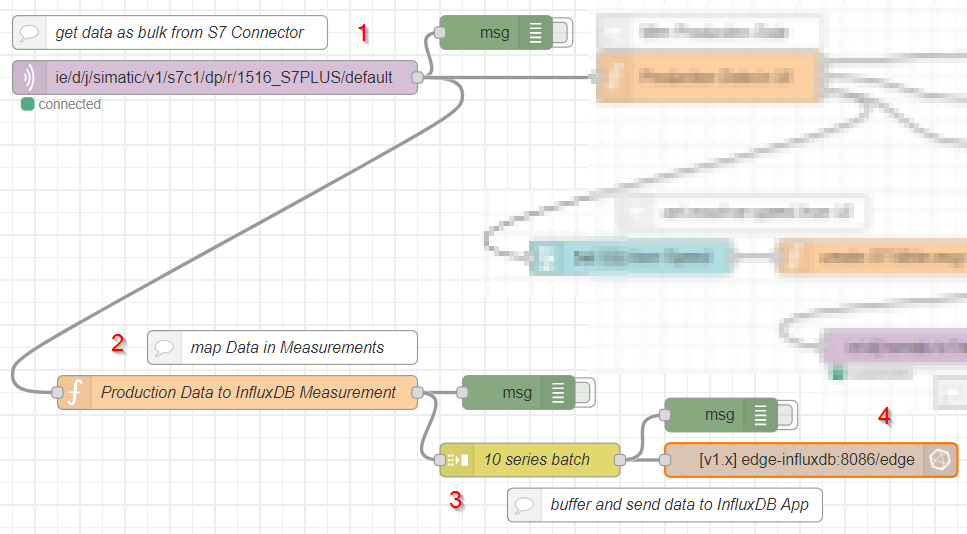

#### Bulk message receiving from MQTT

Through the **"MQTT In"** node, Flow Creator connects to the MQTT IE Databus Broker, using the topic dedicated to the PLC configured for the purpose, named in this example as `"1516_S7PLUS"`:

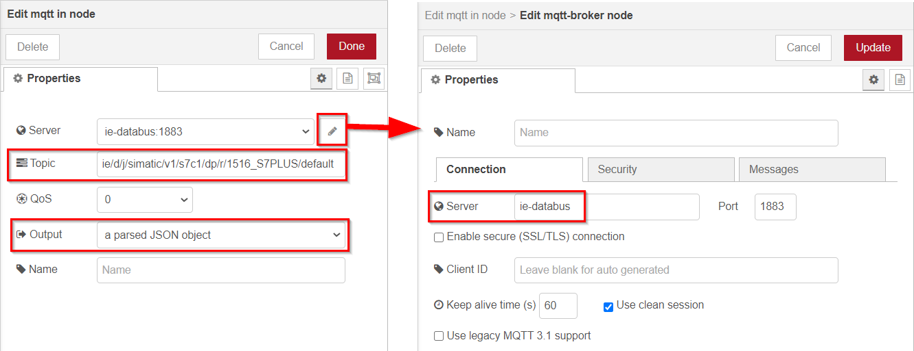

Here, at each read cycle, we will receive messages from MQTT IE Databus, which contains all the data read from the S7-1500 PLC configured within the S7 Connector application. The name of the configured PLC will be part of the topic to be subscribed.

Below is an example of output for the "MQTT In" node:

```json
{
  "topic": "ie/d/j/simatic/v1/s7c1/dp/r/1516_S7PLUS/default",
  "payload": {
    "seq": 84631,
    "vals": [
      {
        "id": "101",
        "qc": 3,
        "ts": "2021-03-10T22:23:04.146Z",
        "val": 80
      },
      {
        "id": "102",
        "qc": 3,
        "ts": "2021-03-10T22:23:04.146Z",
        "val": 20
      },
      {
        "id": "103",
        "qc": 3,
        "ts": "2021-03-10T22:23:04.146Z",
        "val": 120.5
      }
    ]
  }
}
```

Connecting to the MQTT broker SIMATIC IE Databus requires the configuration of a data exchange-enabled user. In this case it was configured using the following parameters:

| IE Databus Address | IE Databus Port | IE Databus User | IE Databus Password |
|--------------------|-----------------|-----------------|---------------------|
| ie-databus | 1883 | simatic | simatic |

#### Pre-processing Data for InfluxDB

Before being able to save the received data in the Influx DB database it will be necessary to format the message received from the **"MQTT In"** node through a **"function"** node, according to the specifications required by the dedicated **"influx-out"** node that allows you to send in different ways new data inside the InfluxDB database, as specified in the dedicated [node-red-contrib-influxdb documentation](https://flows.nodered.org/node/node-red-contrib-influxdb).

In this case we will create an InfluxDB **Measurement** called `"production"` in which we will insert several InfluxDB **"Fields"** corresponding to each of the variables read by S7 Connector and an InfluxDB **"Tag"**, a metadata indicating the machine of origin of each set of InfluxDB "Fields":

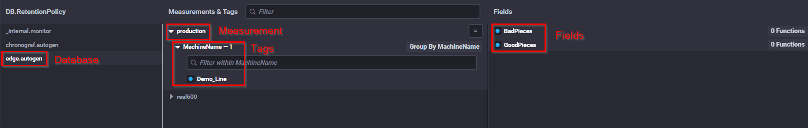

See [Usage] section for more details.

Considering the variables used in this application example, in order to insert the data read into the InfluxDB database with the model presented above, the **"influx-out"** node requires that the `msg.payload` property at the node's input has the following structure:

```json
[
  [
    {
      "Production_BadPieces": 2,
      "Production_GoodPieces": 10,
      "time": 1616881844000000
    },
    {
      "MachineName":"test_machine"
    }
  ],
  [
    {
      "Production_GoodPieces": 14,
      "time": 1616881845000000
    },
    {
      "machine":"test_machine"
    }
  ]
]
```

We will send a **batch of 10 data sets** in the form of an array, where each element is an array composed of two elements: the first is an object containing the **"Field"** properties in the JSON form `"FieldKey: FieldValue"` and the **timestamp** of each set, the second is an object containing the **"Tag"** properties in the JSON form `"TagKey: TagValue"`.

The **"function"** node allows you to process an input message through a script in Javascript language and create one or more output messages.
With the following function we will transform the msg.payload property received from IE Databus with the **"MQTT In"** node, which contains all the data read by the S7-1500 PLC configured in the S7 Connector application, into a message corresponding to the standard required by the **"influx-out"** node as indicated above:

```js
// create out message
let outMsg = {"payload": null};

// Insert here the ordered output tag list
let selectedTags = ["Production_GoodPieces",
                    "Production_BadPieces",
                    "Production_MachSpeed"];
    
// get S7Map variable
let S7ConnectionMap = flow.get("S7ConnectionMap");

// find index of 1516_S7PLUS connection
let connectionIndex = S7ConnectionMap.nameList.indexOf("1516_S7PLUS");
// use the index to get the right map
let nameIDMap = S7ConnectionMap.nameIDMaps[connectionIndex];

// get IDs of selected Tags
let selectedIDs = selectedTags.map(name => nameIDMap.get(name));

// create an empty series with null timestamp
let outSeries = [{"time": null}, {"machine": "test_machine"}]

// iterate through readed tags
for (let i=0; i < msg.payload.vals.length; i++){
    
    // iterate through selected ids
    for(let j=0; j < selectedIDs.length; j++){
    
        // search for tagselectedTags[j]
        if(msg.payload.vals[i].id == selectedIDs[j])
        {
            outSeries[0].time = new Date(Date.parse(msg.payload.vals[i].ts)).getTime();
            outSeries[0][selectedTags[j]] =             Number(msg.payload.vals[i].val.toFixed(2));

            // stop on first match, ids are uniques
            break;
        }
    }
}

// if time was changed means that some ids was finded
if (outSeries[0].time)
{
    outMsg.payload = outSeries;
    return outMsg;
}
```

This function will output from the **"function"** node an array containing one or more **"fields"** according to the input data received. The `"id"` property of each variable read is compared with the id of the selected variables retrieved through the **"S7ConnectionMap"** global variable and in case of a match the function continues. The **timestamp** (epoch) in ms is obtained from the `"ts"` property of each variable read. The value of the variable identified by the `"val"` property is converted to a number and eventually approximated to 3 decimal places.
The InfluxDB **"Tag"** named `"machine"` is added as metadata for each data set.

The next **"join"** node will take care of creating the array of series that identifies the batch of data to be subsequently inserted into the InfluxDB database with the `"production"` measure.

#### Buffer datasets in Batch

The InfluxDB database is optimized for time series and can handle higher query loads, but it is a good habit to try to **optimize the write load** by collecting some data before writing it to the database.
This **data buffer** function can be simply created in Flow Creator using a **"join"** node, which is responsible for merging a series of messages into a single message according to various rules and configurations.

In this application example, the "join" node used creates a **batch of 5 data sets** in the form of arrays. Once the message counter reaches the limit identified by the configured `"count"` property, the "join" node will proceed to send the data batch to the InfluxDB database.

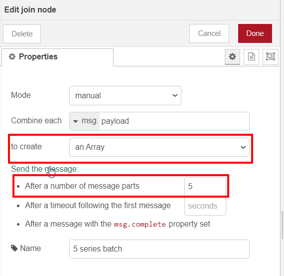

#### Sending Data to InfluxDB

You can take advantage of the [InfluxDB API](https://docs.influxdata.com/influxdb/v1.8/tools/api/#influxdb-1x-http-endpoints) exposed by InfluxDB to exchange data with the database. These InfluxDB APIs are the basis of the Node-RED node **node-red-contrib-influxdb**, created to write and query data from an InfluxDB time series database.
These nodes support both InfluxDB 1.x and InfluxDB 2.0 databases in a configurable manner. To check the options provided by the different versions see dedicated documentation of the [node-red-contrib-influxdb](https://flows.nodered.org/node/node-red-contrib-influxdb) node.

The **edge-influxdata-stack** application provided includes the `"edge-influxdb"` service container based on InfluxDB version 1.8 and exposes a pre-defined **database** named `"edge"` with pre-configured `"edge" / "edge"` **user** and **password**. This application can be contacted by other applications present both on the Edge Device used and by **external networks** connected to the physical ports of the Edge Device thanks to the Port forwarding functionality offered by the Docker service.
These parameters can be inserted directly in the configuration of the "Server" parameter of the nodes of the node-red-contrib-influxdb library:

| Service Name | Hostname | Internal Port | External Host | External Port | Database | Name | User | Password |
|---------------|---------------|------|------------------------------------|-------|------|------|
| edge-influxdb | edge-influxdb | 8086 | [ied-ip-address] or [ied-dns-name] | 38086 | edge | edge |

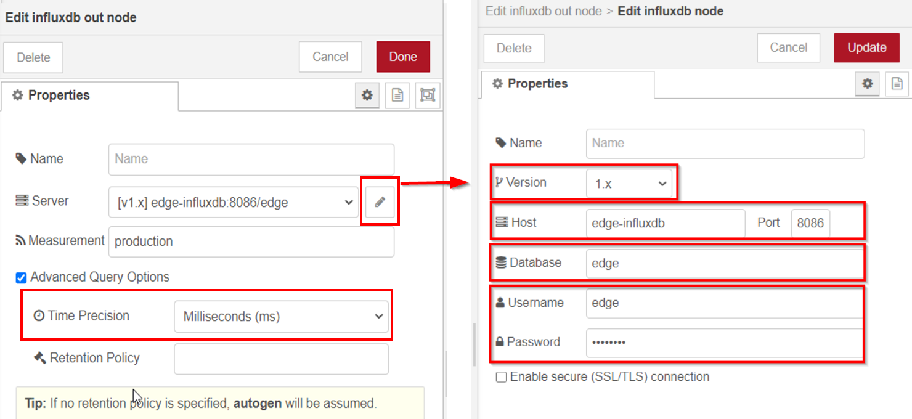

Using the **"Advanced Query Options"** checkbox, it is also possible to predefine the precision of the time inserted in the data series. As defined in the "InfluxDB Data Preprocessing" paragraph, in this application example the time (epoch) is calculated in ms and the **"Time Precision"** option is therefore set to `"milliseconds (ms)"`.

### Dashboard for Displaying Results with Chronograf

The **edge-influxdata-stack** application comes with the `"edge-chronograf"` service, the administrative user interface and the stack visualization engine. With the Chronograf application, among other things, you can both explore data in various databases and quickly create Web Dashboards with graphical objects.

In this application example, the [Production_Chronograf.json](examples/Production_Chronograf.json) dashboard is provided, which can be directly imported as a file in JSON format. To import the dashboard:

1. Connect to the Chronograf interface using the URL `https://[device-ip-address]/edge-chronograf/`
2. In the section **"Dashboards"** press the button **"Import Dashboard"**.
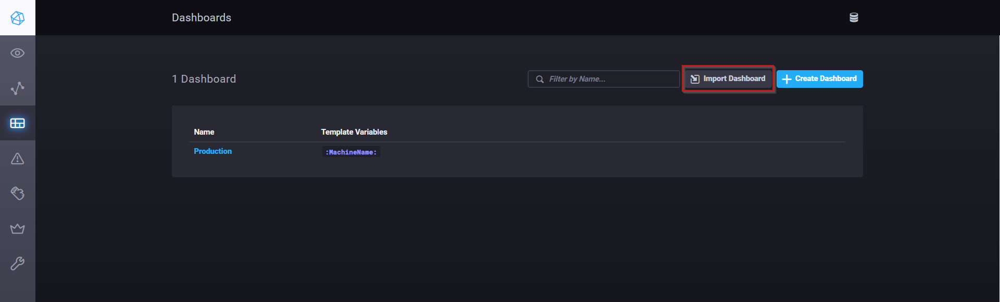

3. And choose the provided [Production_Chronograf.json](examples/Production_Chronograf.json) file
4. At the completion the dashboard "Production" will be visible
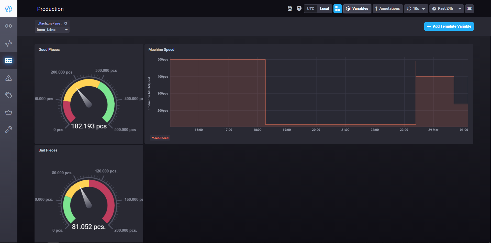

#### Create new widget on Dashboard Chronograf

Dashboards are customizable with new graphical objects and queries, and you can create multiple of them.
In order to create a new widget inside the Chronograf dashboard :

1. Go to **"Dashboard"** section and open your dashboard
2. press the button **"Add a cell to Dashboard"**.
3. First select the reference **database** (e.g. `"edge"`), then the desired **measurement** (e.g. `"production"`) and then all the desired **"fields"** and **"tags"**. A standard query for reading the selected data will automatically appear, which you can customize according to the purpose.
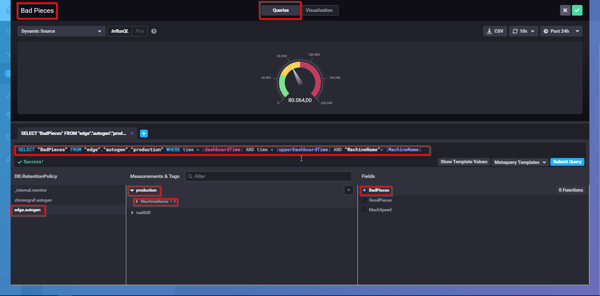

4. In the **"Visualization"** menu you can choose the type of object to display and some graphic settings such as thresholds, colors and more:
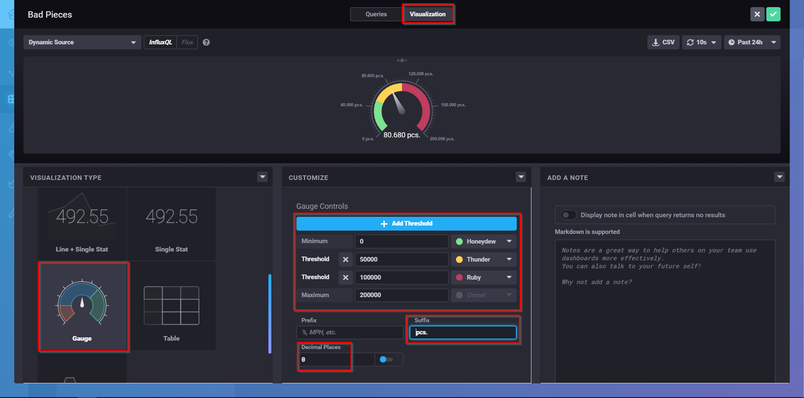

5. Press the confirmation button in the top right corner to insert the new object inside the Dashboard.

### Read data from dedicated InfluxDB database with temporal and conditional filtering

In addition to entering new data within an InfluxDB database "measurement", you may need to query the database to process and request **historical data**, for example for visualization, analysis or reporting purposes.
The **node-red-contrib-influxdb** node library provides the ability to perform **custom queries** to query one or more measurements in an InfluxDB database via the **"influxdb-in"** node. The query is specified in the node configuration or via the `msg.query` property. The result of the query is returned in the output message from the node with via the `msg.payload` property.

Within the SIMATIC Flow Creator flow of the provided application example, the reading of data from the InfluxDB database is triggered by a trigger message from the **"inject" (1)** node every 30 seconds, after which the **"influxdb-in" (2)** node sends the configured query to the InfluxDB database. Once the response is obtained, it is processed and formatted by a **"function" (3)** node for displaying a chart on Dashboard via the **"ui_chart" (4)**.
The details of the NodeRED flow involved are shown below:

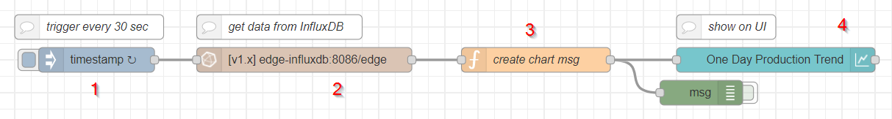

In this application example we will use the node **"influxdb-in"** connected to the database service `"edge-influxdb"` and a dedicated query to read the saved data `"Production_GoodPieces"` and `"Production_BadPieces"` in the last 24 hours and aggregate them in order to reduce the number of samples to be displayed.

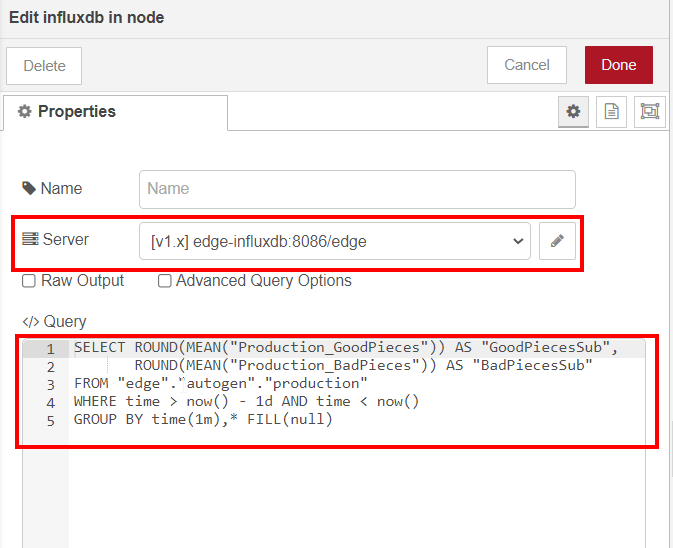

The syntax used for the query is **InfluxQL**. For more information about the InfluxQL query language visit the [official documentation](https://docs.influxdata.com/influxdb/v1.8/query_language/).

```sql
SELECT ROUND(MEAN("Production_GoodPieces")) AS "GoodPiecesSub", 
       ROUND(MEAN("Production_BadPieces")) AS "BadPiecesSub")
FROM "edge". "autogen". "production". 
WHERE time > now() - 1d AND time < now()
GROUP BY time(1m),* FILL(null)
```

The **query** above will select from the data of the **last 24 hours** the **average** of the values `"Production_GoodPieces"` and `"Production_BadPieces"` for **each minute**. This allows the raw data, collected every second, to be subsampled by a factor of _1/60_.
The database response is then output to the **"influxdb-in"** node with the `msg.payload` property. This will be an array containing the different time series of **"Field"** and **"Tags"** and their values. Below is an example of the message received in response to the query:

```json
{
    "payload":[
        {
            "time":"2021-03-27T20:47:00.000Z",
            "GoodPiecesSub":131096,
            "BadPiecesSub":57514,
            "machine":"test_machine"
        },
        {
            "time":"2021-03-27T20:48:00.000Z",
            "GoodPiecesSub":131327,
            "BadPiecesSub":57597,
            "machine":"test_machine"
        },
    …
    …
    …
        {
            "time":"2021-03-28T20:47:00.000Z",
            "GoodPiecesSub":131802,
            "BadPiecesSub":59069,
            "machine":"test_machine"
        },
        {
            "time":"2021-03-28T20:48:00.000Z",
            "GoodPiecesSub":131886,
            "BadPiecesSub":59106,
            "machine":"test_machine"
        }
    ],
    "topic":""
}
```

### Dashboard for Displaying Results with SIMATIC Flow Creator

In order to visualize the data obtained from the previously described query, it is possible to use the **Web Dashboard** functionality of **SIMATIC Flow Creator** with the nodes of the `"node-red-dashboard"` library, with a number of nodes dedicated to different graphical objects such as gauges, text fields, graphs and more.
For more information about the **"node-red-dashboard"** library visit the [official documentation](https://flows.nodered.org/node/node-red-dashboard).

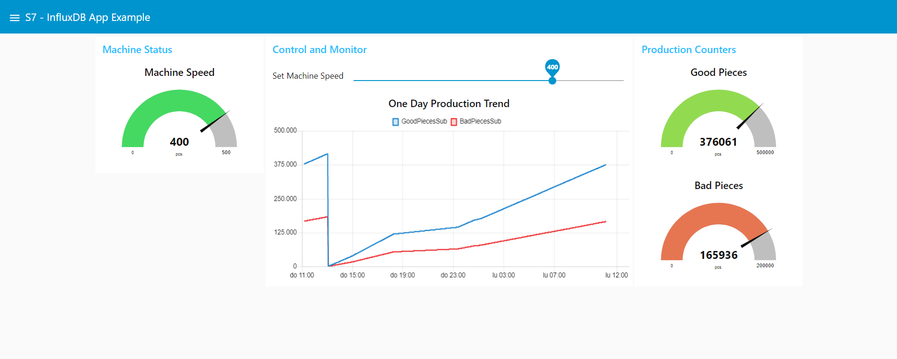

The node **"charts-ui"** allows to visualize different types of charts (lines, bars, pie) on the Web Dashboard of SIMATIC Flow Creator, either by sending new data in real-time or by sending the whole data structure.

In this application example, starting from the data received from the **"influxdb-out"** node as a result of the query, the correct data structure will be created for the visualization of a **line graph** containing the data of the **last 24 hours**. Using the **"charts-ui"** node, it is possible to define the various configuration parameters such as the **Tab ("S7 - InfluxDB App Example")** and the **Group ("Control and Monitor")** Dashboard they belong to:

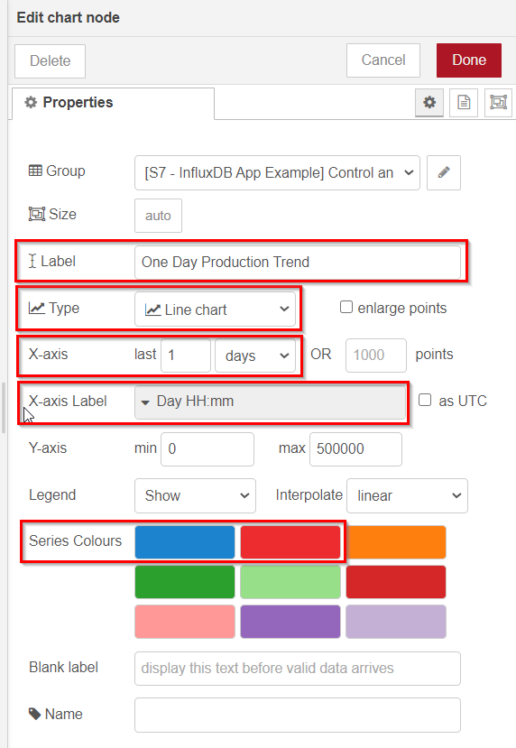

Before proceeding to visualization, it will be necessary to correctly **format** the data according to the standard of the **"chart-ui"** node, using in this case a **"function"** node with a function dedicated to processing the array of temporal series received.
For more information on how to correctly format one or more series of data for visualization through the **"chart-ui"** node, visit the [official documentation of the node-red-dashboard dedicated specifically to this node](https://github.com/node-red/node-red-dashboard/blob/master/Charts.md).

Below is the function used for formatting the received time series:

```js
// define influxdb fields names
let outFields = ["GoodPiecesSub", "BadPiecesSub"]

// create base out message
let outMsg = {payload:[{}]};

// create chart properties
outMsg.payload[0].series = [outFields[0], outFields[1]];
outMsg.payload[0].data = [[],[]];
outMsg.payload[0].labels = [""];

// scan input data series and create chart data series
for (let i = 0; i < msg.payload.length; i++)
{
    let ts = new Date(msg.payload[i].time).getTime();
    // if value of selected fields exist, push to data array togheter with timestamp
    if (msg.payload[i][outFields[0]] !== null)
    {
        outMsg.payload[0].data[0].push({"x": ts, "y": msg.payload[i][outFields[0]]});    
    }
    if (msg.payload[i][outFields[1]] !== null)
    {
        outMsg.payload[0].data[1].push({"x": ts, "y": msg.payload[i][outFields[1]]});   
    }
}

return outMsg;
```

This function creates the data structure for a line graph with two time series named `"GoodPiecesSub"` and `"BadPiecesSub"`, containing several samples and their timestamps. Below is a sample of the message **output** from the **"function"** node:

```json
{
    "payload":[
        {
            "series":["GoodPiecesSub","BadPiecesSub"],
            "data":[
                [
                    {
                        "x":1616884320000,
                        "y":166138
                    },
      …
      …
      …
                    {
                        "x":1616944260000,
                        "y":92754
                    }
                ],
                [
                    {
                        "x":1616884320000,
                        "y":72844
                    },
      …
      …
      …
                    {
                        "x":1616944260000,
                        "y":41251
                    }
                ]
            ],
            "labels":[""]
        }
    ]
}
```

The formatted data can be viewed directly as two series on a line graph by connecting to the SIMATIC Flow Creator web dashboard using the link `https://[device-ip-address]/ui/` :

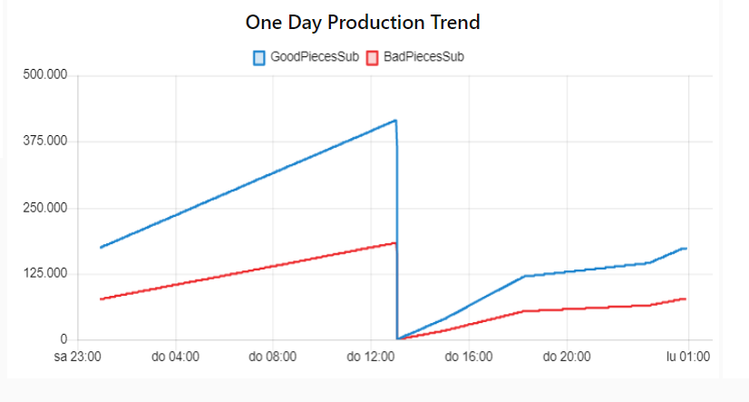

## Build

The application is composed of several microservices, all based on the "TICK stack" provided by InfluxData. For more information about TICK Stack see the official [InfluxData page](https://www.influxdata.com/time-series-platform/).
The microservices used in this version are:

- **InfluxDB**
- **Kapacitor**
- **Chronograf**

The generated edge application will also be provided with a "service name" that will allow you to reach Chronograf web dashboard. For more information follow the section [Reverse Proxy Configuration for Chronograf](#reverse-proxy-configuration-for-chronograf).

The base images that make up this app were built using [docker-compose](https://docs.docker.com/compose/) tool with the command below on the [docker-compose.yml](docker-compose.yml) file.

```bash
docker-compose up -d --build 
```

The  [docker-compose.yml](docker-compose.yml) file will creates and runs the following services:

- **edge-influxdb**:
  - builds the custom Docker image `edge-influxdb:0.0.1` using the [influxdb/Dockerfile](influxdb/Dockerfile) file.
  - Maps **ports** 8086 and 8088, needed to use the database, to ports 38086 and 38088, respectively.
  - Creates the default database _"edge"_ and user _"edge"_ with password _"edge"_ for logging into the InfluxDB database. In this case the **FLUX** query language is kept disabled via the `INFLUXDB_HTTP_FLUX_ENABLED` environment variable.
  - Map the `/var/lib/influxdb` folder inside the edge-influxdb container to the `edge-influxdb-volume` in the host system. This is where all data related to InfluxDB databases will be saved.

- **edge-chronograf**
  - Use the base image `chronograf:1.9-alpine`
  - Map **port** 8888 which allows access to Chronograf web dashboard on port 38888.
  - Sets default connections to **edge-influxdb** and **edge-kapacitor** microservices via dedicated environment variables (`KAPACITOR_URL`, `INFLUXDB_URL`, `INFLUXDB_USER`, `INFLUXDB_PASS`) and prefixes the web dashboard url with the `BASE_PATH` variable. This will be used to set the [Reverse Proxy](#reverse-proxy-configuration-for-chronograf) functionality in the configuration with Edge App Publisher.
  - Map the `/var/lib/chronograf` folder inside the edge-chronograf container to the `edge-chronograf-volume` in the host system. This is where all data related to custom usage of Chronograf will be saved.
  - Waits for the edge-influxdb and edge-kapacitor microservices to be running via the `depends_on` field
  
- **edge-kapacitor**
  - Uses the base image `kapacitor:1.5-alpine`
  - Sets the default connection to the **edge-influxdb** microservice via the dedicated environment variable `KAPACITOR_INFLUXDB_0_URLS_0`
  - Sets the connection to the MQTT **ie-databus** Broker offered by Industrial Edge devices through the dedicated `KAPACITOR_MQTT_0_NAME`, `KAPACITOR_MQTT_0_URL`, `KAPACITOR_MQTT_0_USER`, `KAPACITOR_MQTT_0_PASSWORD` environment variables, as shown [here](https://docs.influxdata.com/kapacitor/v1.6/administration/configuration/#kapacitor-configuration-file-location)
  - Map the `/var/lib/kapacitor` folder inside the edge-kapacitor container to the `edge-kapacitor-volume` in the host system. This is where all data related to custom usage of Kapacitor will be saved.
  - Waits for the edge-influxdb microservice to be running via the `depends_on` field

### Influxdb/Dockerfile

In order to customize the base Docker image for the edge-influxdb microservice in this App, the following [Dockerfile](influxdb/Dockerfile)) was used:

```Dockerfile
#from base image
FROM influxdb:1.8-alpine

COPY ./influxdb.conf /etc/influxdb/influxdb.conf
```

- From the [docker-compose](docker-compose.yml) file, Docker will start the process of building the `edge-influxdb` microservice from the `influxdb:1.8-alpine` base image with the Alpine Linux system and InfluxDB pre-installed.
- The `influxdb.conf` file containing the modified InfluxDB configuration is copied to the default path `/etc/influxdb/influxdb.conf`. The parameters changed from the default configuration are:

| Section | Property | Default | Value |
|---------|----------|---------|-------|
| data | index-version | "tsi1" | "inmem" |
| monitor | store-interval | "12s" | "10s" |
| subscriber | write-concurrency | 50 | 40 |

For details on the reasons for using the **"tsi1"** mode visit the following [link](https://www.influxdata.com/blog/how-to-overcome-memory-usage-challenges-with-the-time-series-index/).

### Importing the app into Edge App Publisher

To import the app into the SIMATIC Edge App Publisher software, you can use the edge-influxdata-stack_x.x.x.app file by loading it with the "Import" button within your app directory or alternatively you can build the images in a Docker environment using the docker-compose.yml file described above.

Importing the [docker-compose.yml](docker-compose.yml) file described above into the Edge App Publisher will apply some changes to make the app compatible with the SIMATIC Edge environment:

- The build parameter is removed since the image has already been built.

### Reverse Proxy Configuration for Chronograf

The edge-influxdata-stack application uses the reverse proxy functionality offered by the SIMATIC Edge platform, which allows you to map a service name to an application URL endpoint by replacing the path `http(s)://[device-ip-address]:[my-app-port]/my-app-path/` with `https://[device-ip-address]/my-reverse-proxy-app-path/`.

In this application we expose the GUI of the "edge-chronograf" service for administration and exploration of the InfluxDB database. This service, as specified in the files specified above, would be reachable using port 38888 on the Edge Device's external network, which is in turn "connected" to port 8888 of the "edge-chronograf" service thanks to the Docker runtime.

Using the reverse proxy with service name "edge-chronograf" will allow the following mapping:

`http://[device-ip-address]:38888` &#8594; `https://[device-ip-address>]/edge-chronograf`

To set up the Reverse Proxy functionality, within the Industrial Edge App Publisher software the "Network" section has been configured on the "edge-chronograf" service with the following parameters:

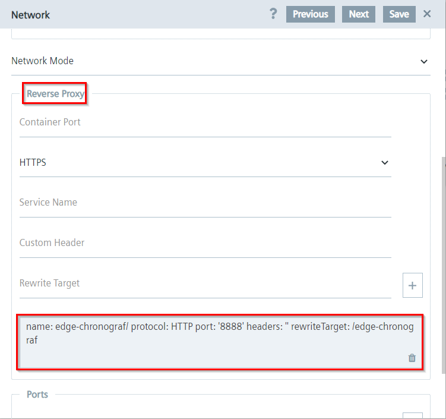

| Docker Service | Container Port | Protocol | Service Name | Rewrite Target |
|----------------|----------------|----------|-------------|----------------|
|edge-chronograf | 8888 | HTTP | edge-chronograf/ | /  | edge-chronograf |

Chronograf provides the possibility to configure the path to be used as Reverse Proxy using the BASE_PATH environment variable. This environment variable has been set directly inside the docker-compose file, as specified also in the previous chapters.

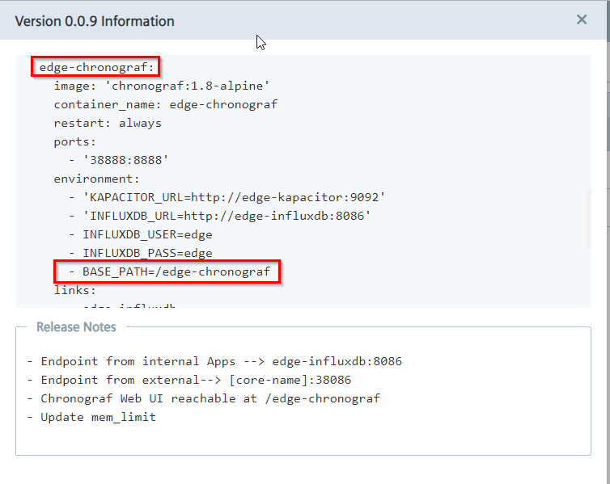

For more information about the `BASE_PATH` environment variable and the other environment variables used by Chronograf see the official documentation [here](https://docs.influxdata.com/chronograf/v1.8/administration/config-options/#--basepath---p).

## Documentation

- [node-red-contrib-influxdb](https://flows.nodered.org/node/node-red-contrib-influxdb)
- [Docker Hub - InfluxDB](https://hub.docker.com/_/influxdb)

You can find further documentation and help about Industrial Edge in the following links:

- [Industrial Edge Hub](https://iehub.eu1.edge.siemens.cloud/#/documentation)
- [Industrial Edge Forum](https://www.siemens.com/industrial-edge-forum)
- [Industrial Edge landing page](https://new.siemens.com/global/en/products/automation/topic-areas/industrial-edge/simatic-edge.html)
- [Industrial Edge GitHub page](https://github.com/industrial-edge)
- [Industrial Edge App Developer Guide](https://support.industry.siemens.com/cs/ww/en/view/109795865)

## Contribution

Thanks for your interest in contributing. Anybody is free to report bugs, unclear documentation, and other problems regarding this repository in the Issues section or, even better, is free to propose any changes to this repository using Merge Requests.

## License & Legal Information

Please read the [Legal Information](LICENSE.md).
